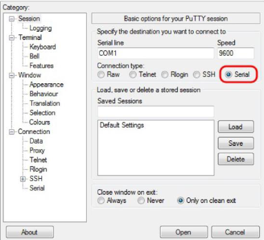
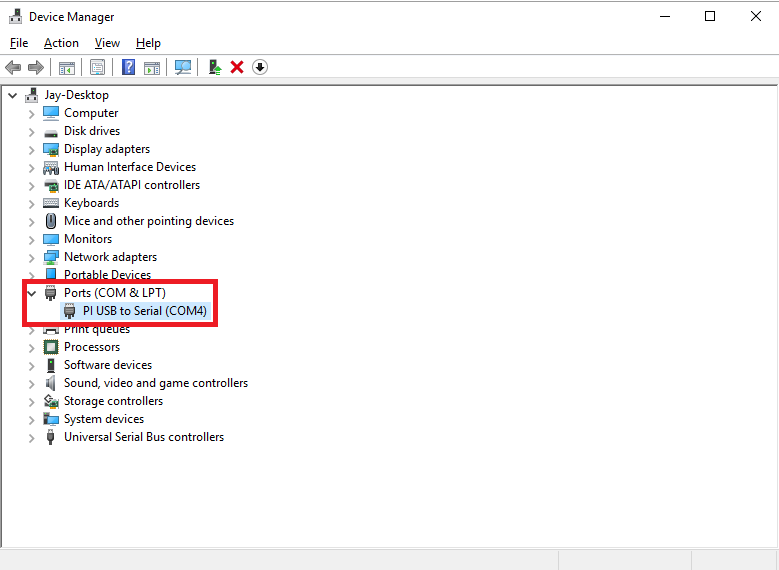
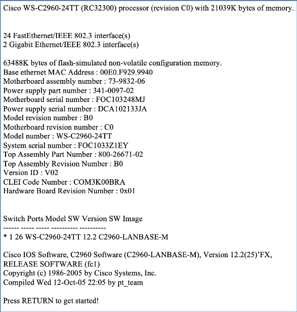

###  SETUP

# 1. Verbinding maken met de apparatuur

## Benodigdheden :
1. (blauwe) console kabel
2. usb poort aka com poort (seriële poort)
3. terminal-emulator: putty or kitty

## Putty Settings

```

    Bits per second: 9600
    Data bits: 8
    Parity: none
    Stop bits: 1
    Flow Control: none

```



**check com poort op je eigen pc open ```Device Manager``` !!!**


# 2. Booten

## Opstart procedure
1. Turn on Cisco device
2. POST (Power On Self Test) $${\color{green}happens automatic}$$
3. Boot sequentie => ``` ######################  ```
4. ``` “Press RETURN to get started!” ``` 
5. ``` Would you like to enter the initial configuration dialog ? [yes/no]  => $${\color{red}NO}$$ ``` 
> De optie **“yes”** start de wizard op.
> De optie **“no”** laat toe om verder te gaan met de huidige ingestelde configuratie.



# 3. De betekenis van de LED indicatoren op een toestel.

De betekenis van de kleuren is echter redelijk universeel:
- Geen lichtje → niet aangesloten
- Groen lichtje →aangesloten
- Groen knipperend lichtje → aangesloten en er is iets van activiteit gaande
- Oranje/rood lichtje → hier is iets mis
- Oranje/rood knipperend lichtje → bezig met iets recht te zetten dat misschien vanzelf in orde gaat komen
