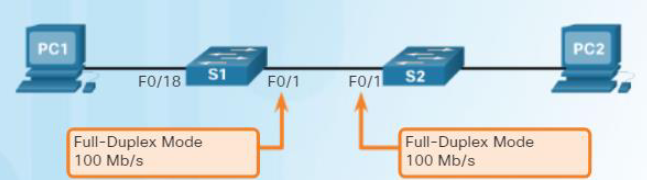
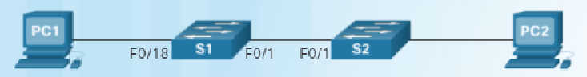
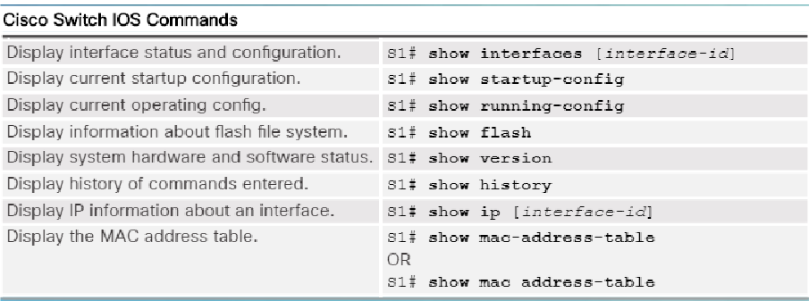

### Overvieuw Basic Switch Settings

> content :
> 
> - [Switch toegang via het netwerk](#Switch-toegang-via-het-netwerk)
> - [Switch toegang beveiligen](#Switch-toegang-beveiligen)
> - [Fysieke poorten configureren](#Fysieke-poorten-configureren)
> - [Switch configuratie verifiëren](#Switch-configuratie-verifiëren)
> - [Switch poorten beveiligen](#Switch-poorten-beveiligen)

# Switch toegang <u>via het netwerk</u>

## 1. Switch Virtual Interface (= SVI)

| Commando                                                  | uitleg                                                                                |
| -----------                                               | -----------                                                                           |
| Switch>enable                                             | Overgaan naar privileged mode                                                         |
| Switch#configure terminal                                 | Overgaan naar configuration mode                                                      |
| Switch(config)#vlan 99                                    | Een vlan met ID-nr 99 aanmaken                                                        |
| Switch(config-vlan)#exit                                  | Teruggaan naar configuration mode                                                     |
| Switch(config)#interface vlan 99                          | Overgaan naar interface configuratie mode van vlan 99 om de SVI te configureren       |
| Switch(config-if)#ip address 192.168.1.2 255.255.255.0    | Een IP adres en masker toekennen aan de SVI van vlan 99.                              |
| Switch(config-if)#no shutdown                             | De SVI actief zetten                                                                  |
| Switch(config-if)#exit                                    | Overgaan naar configuration mode                                                      |
| Switch(config)#interface range f0/1 – 24 , g0/1 - 2       | De 24 fast-ethernet poorten + de 2 gigabit ethernet poorten van de switch selecteren  |
| Switch(config-if-range)#switchport access vlan 99         | Al deze poorten lid maken van vlan 99                                                 |
| Switch(config-if-range)#exit                              | Teruggaan naar configuration mode                                                     |
| Switch(config)#ip default-gateway 192.168.1.254           | Default gateway instellen                                                             |
| Switch(config)#exit                                       | Teruggaan naar privileged mode                                                        |
| Switch#show vlan brief                                    | Een kort overzicht geven van welke poorten deel uitmaken van vlan 99.                 |
| Switch#copy run start                                      | De configuratie bewaren                                                              |

---

# Switch toegang <u>beveiligen</u>

## 1. Console toegang beveiligen

| Commando                                                  | uitleg                                                                                |
| -----------                                               | -----------                                                                           |
| Switch>enable                                             | Overgaan naar privileged mode                                                         |
| Switch#configure terminal                                 | Overgaan naar configuration mode                                                      |
| Switch(config)#line console 0                             | De toegang via consolekabel regelen                                                   |
| Switch(config-line)#password cisco                        | Als out-band wachtwoord ‘cisco’ instellen                                             |
| Switch(config-line)#login                                 | Enablen van password checking bij benaderen via console                               |
| Switch(config-line)#end                                   | Terugkeren naar privileged mode                                                       |

## 2. Telnet toegang beveiligen

| Commando                                                  | uitleg                                                                                |
| -----------                                               | -----------                                                                           |
| Switch>enable                                             | Overgaan naar privileged mode                                                         |
| Switch#configure terminal                                 | Overgaan naar configuration mode                                                      |
| Switch(config)#line vty 0 15                              | De toegang via telnet kanalen 0 tot en met 15 regelen                                 |
| Switch(config-line)#password cisco                        | Als toegangswachtwoord ‘cisco’ instellen                                              |
| Switch(config-line)#login                                 | Controleren of er nog telnet lijnen onbeveiligd zijn (i.e. of er nog telnet lijnen zonder wachtwoord zijn)|
| Switch(config-line)#end                                   | Terugkeren naar privileged mode                                                       |

## 3. SSH toegang instellen

SSH enkel te gebruiken als IOS versie voldoende hoog is, als de IOS filenaam “k9” bevat, dan kan SSH
Dit kan je checken met : ``` show version  ```


| Commando                                                  | uitleg                                                                                |
| -----------                                               | -----------                                                                           |
| Switch>enable                                             | Overgaan naar privileged mode                                                         |
| Switch#show ip ssh                                        | Nakijken of de switch ssh ondersteunt                                                 |
| Switch#configure terminal                                 | Overgaan naar global configuration mode                                               |
| Switch(config)#ip ssh version 2                           | Instellen dat switch ssh versie 2 moet gebruiken                                      |
| Switch(config)#ip domain-name                             | De naam van het netwerk / domein waarin de switch functioneert, instellen             |
| Switch(config)#crypto key generate rsa :one:              | Encryptie sleutel genereren. Modulus lengte zelf op te geven (hoe langer de key, hoe veiliger. Bvb 1024 bits|
| Switch(config)#username admin secret cisco                | User admin aanmaken die zich zal moeten aanmelden met wachtwoord 'cisco'              |
| Switch(config-line)#line vty 0 15                         | Alle mogelijke ssh lijnen selecteren                                                  |
| Switch(config-line)#transport input ssh                   | Instellen dat op alle lijnen enkel toegang via ssh mogelijk is                        |
| Switch(config-line)#login local                           | Afdwingen dat users zich lokaal authenticeren als ze de switch benaderen via ssh      |


:one: [more info : *crypto key generate rsa*](https://www.cisco.com/c/en/us/td/docs/ios-xml/ios/security/a1/sec-a1-xe-3se-3650-cr-book/sec-a1-xe-3se-3850-cr-book_chapter_0110.pdf#_OPENTOPIC_TOC_PROCESSING_d68e83)


# Fysieke poorten configureren

## 1. Fysieke poorten configureren

*specific config*
| Commando                                                  | uitleg                                                                                |
| -----------                                               | -----------                                                                           |
| Switch(config)#interface fa 0/1                           | Poort fa0/1 gaan configureren                                                         |
| Switch(config-if)#duplex full                             | Poort fa 0/1 in full duplex mode zetten                                               |
| Switch(config-if)#speed 100                               | Port speed instellen op 100 Mb/s                                                      |
| Switch(config-line)#end                                   | Terugkeren naar privileged mode                                                       |



*auto config*
| Commando                                                  | uitleg                                                                                |
| -----------                                               | -----------                                                                           |
| Switch(config)#interface fa 0/1                           | Poort fa0/1 gaan configureren                                                         |
| Switch(config-if)#duplex auto                             | Poort fa 0/1 in full duplex mode zetten                                               |
| Switch(config-if)#speed auto                              | Port speed instellen op automatische selectie                                         |
| Switch(config-if)#mdix auto                               | Mdix instellen op automatisch                                                         |
| Switch(config-line)#end                                   | Terugkeren naar privileged mode                                                       |




# Switch configuratie verifiëren

## 1. Config checken

> Na het configureren, steeds de stap van het verifiëren en het testen
> Nakijken of alles wat we denken ingesteld te hebben, ook klopt
> **Pingen** om connectiviteit te testen



## 2. Troubleshooting

```show interfaces``` 

- In de output: sprake van zowel de interface zelf als van het zogenaamde line protocol.
- Voor beiden verschillende toestanden mogelijk.

# Switch poorten beveiligen

## 1. Switch poorten disablen

| Commando                                                  | uitleg                                                                                |
| -----------                                               | -----------                                                                           |
| Switch(config)#interface fa 0/1                           | Poort fa0/1 gaan configureren                                                         |
| Switch(config-if)#shutdown                                | Poort fa 0/1 disablen                                                                 |
| Switch(config-if)#exit                                    |                                                                                       |
| Switch(config)#interface range f0/12 - 24                 | Poorten 12 tot en met 24 selecteren                                                   |
| Switch(config-line)#shutdown                              | De zonet geselecteerde poorten disablen                                               |


## 2. Port security commands

> *Port security*
> - **Protect**: paketten met onbekende MAC adressen worden gedropt zonder melding
> - **Restrict**: paketten met onbekende MAC adressen worden gedropt met melding
> - **Shutdown**: poort wordt gedisabled. Is de standaard violation mode.

| Commando                                                  | uitleg                                                                                |
| -----------                                               | -----------                                                                           |
| Switch(config)#interface fa 0/18                          | Poort fa0/18 gaan configureren                                                        |
| Switch(config-if)#switchport mode access                  | Instellen dat de poort een access poort is,verbonden met een end-device               |
| Switch(config-if)#switchport port-security                | Port security activeren op poort fa0/18                                               |
| Switch(config-if)#switchport port-security maximum 1      | Instellen dat er **maximum 1 MAC** adres achter de poort mag zitten                   |
| Switch(config-if)#switchport port-security mac-address sticky| Sticky learning enablen zodat **dynamisch geleerd** MAC adres als secure wordt geleerd.|
| Switch(config-if)#switchport port-security violation restrict| De violation mode van de poort instellen op restrict. Shutdown is de **default**.  |
| Switch#show port-security interface fa 0/18               | Nakijken welke port security van toepassing is op poort fa 0/18                       |
| Switch#show run | begin FastEthernet 0/18                 | Nakijken wat er in de running-config staat voor poort fa0/18                          |
| Switch#show port-security address                         | Alle MAC adressen tonen die als secure worden beschouwd                               |
| Switch#show interface fa0/18 status                       | De status tonen van poort fa 0/18.                                                    |
| Switch#show interface fa0/18 status                       | Een overzicht van de port security settings op poort 0/18 tonen                       |
